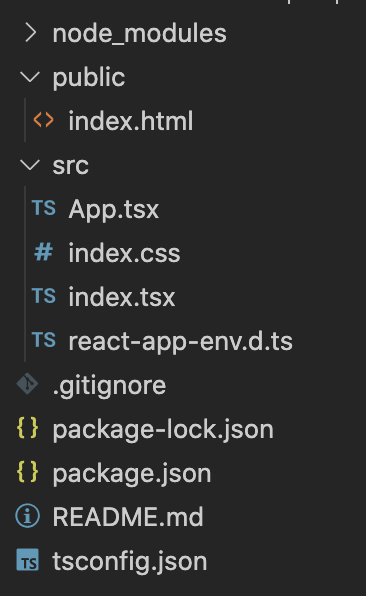

# React App

[](./LICENSE.md)
[](https://www.npmjs.com/package/cra-template-bones)

A lightweight TypeScript template for [Create React App](https://create-react-app.dev/). Reduces source files by two thirds and removes dozens of unecessary modules.



### Usage

```
$ npx create-react-app app-name --template bones
```


<!-- ```shell
$ ls -1R
README.md
package-lock.json
package.json
public
src
tsconfig.json

./public:
index.html

./src:
App.tsx
index.css
index.tsx
react-app-env.d.ts
``` -->